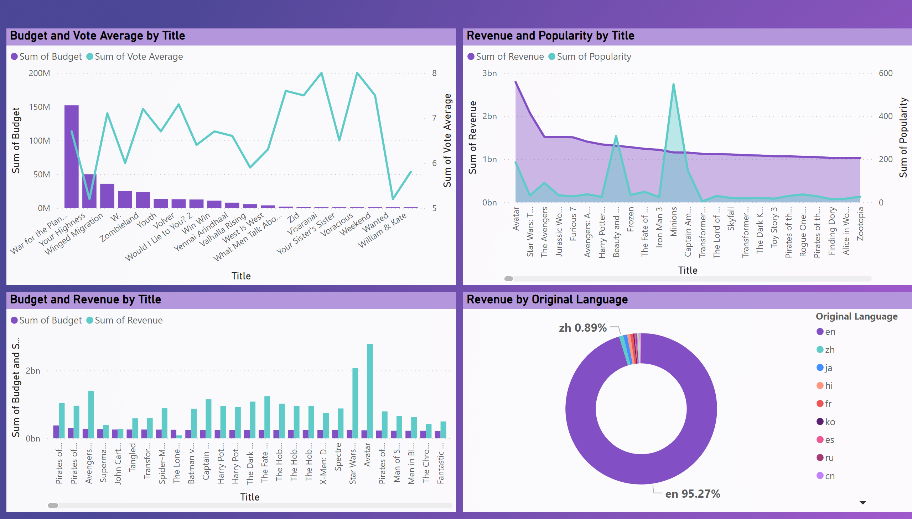
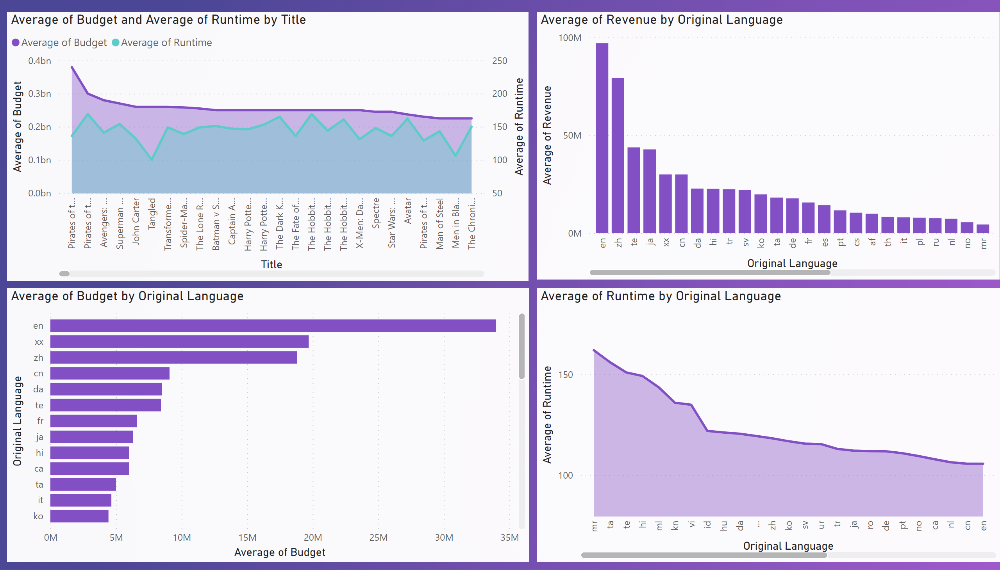
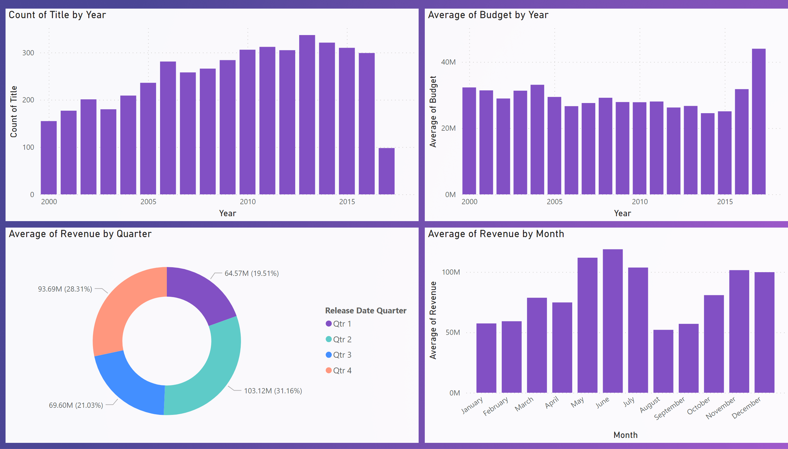

# PowerBI Dashboard
## Project: Movies

### Summary
#### :clipboard: <strong>Sample Data:</strong> Movies released between 2000 to 2017
#### :clipboard: <strong>Sample Size:</strong> Data set contained 4786 rows
#### :clipboard: <strong>Observation (Column):</strong> Data set contained 8 obeservations - Release Date, Title, Runtime, Revenue, Budget, Original Language and Popularity
#### :bar_chart: ETL & Dashboard Tools: PowerBI, Power Query

   
  
(---)

### :mag_right: Key Findings 1: 
  #### :high_brightness: Some title had high average voting but did not made high revenues.
  #### :high_brightness: Some highly popular film did not generate high revene.
  #### :high_brightness: Title generated most revenue had average budget.
  #### :high_brightness: Film in EN generated 95% revenue compare to other languages, this because number of film released in EN was significant.

  

   
  
(---)

### :mag_right: Key Findings 2:
  #### :high_brightness: Average runtime of a film had no significant on average budget per film. 
  #### :high_brightness: English has highest average revenue per language per film followed by the Chinese film.
  #### :high_brightness: English film has the signinficantly high average budget compare to others.
  #### :high_brightness: Marathi (mr) film has the highest average runtime of all language.

  

   
  
(---)

### :mag_right: Key Findings 3:
  #### :high_brightness: Highest number of film released in 2013 and lowest number in 2017.
  #### :high_brightness: Average Budget per film was significantly in 2017.
  #### :high_brightness: Film realeased in Qrt2 and Qrt4 had the highest avareage revenue per film .
  #### :high_brightness: Film released in the month of MAY, JUNE & JULY has higher revenue.

  

  

